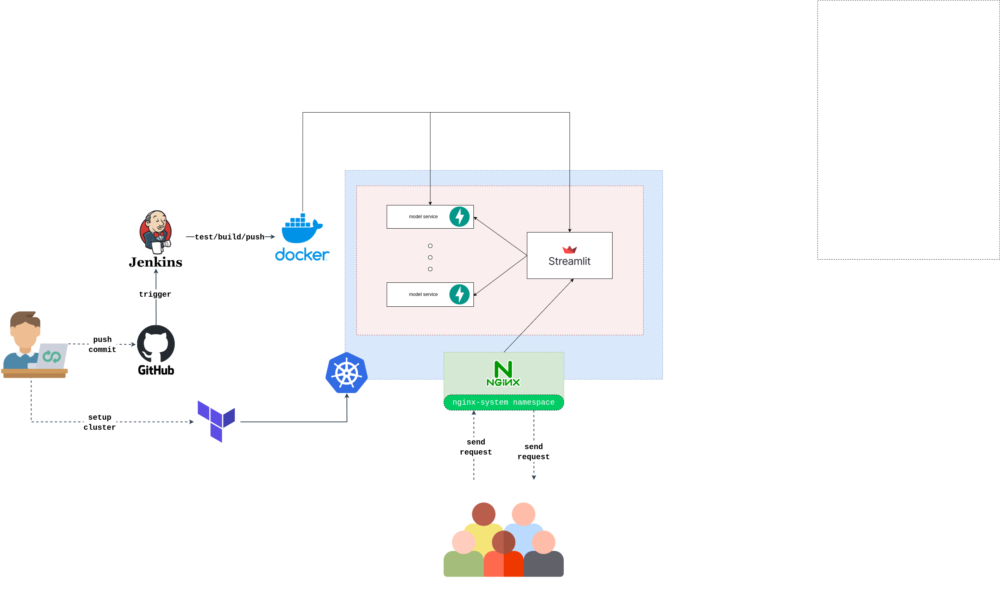

# Loss Teach GDGAIC: Blast Fragment Segmentation
AH yes I will put something in here lol

Still updating...
# __Table of Contents__
**[1. Introduction](#introduction)**
- _[1.1 About us](#about-us)_
- _[1.2 Overview](#overview)_
- _[1.3 Features](#features)_

**[2. Technical Details](#technical-details)**
- _[2.1 Repository's structure](#repositorys-structure)_
- _[2.2 APIs Documentation](#api-documentation)_

**[3. Prerequisites](#prerequisites)**

**[4. Local Setup](#local-setup)**
- _[4.1 Easy Version](#easy-version)_
  - [4.1.1 Local setup with Docker](#local-setup-with-docker)
  - [4.1.2 Local setup on Kubernetes with Minikube](#local-setup-on-kubernetes-with-minikube)
    
- _[4.2 Hard Version](#hard-version)_
  - [4.2.1 Local setup with Docker](#local-setup-with-docker-recommended)
  - [4.2.2 Local setup on Kubernetes with Minikube](#local-setup-on-kubernetes-with-minikube-1)
  - [4.2.3 Local setup by yourself (no Docker, no Minikube) (not recommended)](#local-setup-by-yourself-no-docker-no-minikube-not-recommended)
    
**[5. Cloud Setup](#cloud-setup)**

**[6. Optional Setup](#optional-setup)**
- [6.1 Jenkins for CI/CD](#jenkins-for-cicd)
- [6.2 Prometheus & Grafana for Observable Systems](#prometheus--grafana-for-observable-systems)


# Introduction
## About us
### Teammates
* Nguyen Minh Duc - [ducto489](https://github.com/ducto489) - Leader
* To Thanh Dat - [tothanhdat2006](https://github.com/tothanhdat2006)
* Nguyen Tien Son - [sotsuba](https://github.com/sotsuba) 
### Mentor
* Ngo Hoang Bach - [BachNgoH](https://github.com/BachNgoH)
## Overview
Still updating...
## Features
Still updating...

---
# __Technical Details__
## __Repository’s structure__
```
.
├── app                  # Main directory for application
│   ├── dashboard        # Frontend, built in Streamlit
│   │   └── src          # Utilities for frontend
│   ├── model-api        # Backend, build in FastAPI
│   │   ├── models       # Where you have to put the model.onnx when pulling from huggingface
│   │   ├── routers      # Where to keep the API
│   │   │   ├── core     # API configuration 
│   │   │   └── schema   # Output Schema
│   │   ├── tmp          # Temporary files
│   │   └── utils        # Utilities functions for backend (image processing, size computing,...)
├── bash_utils           # Utilities functions for Bash Scripts
├── docs                 # Decisions
├── iac                  # Infrastructures as Code
│   └── terraform        # Terraform, use as a provision tool for GKE on GCP (Cloud Setup)
│       ├── environments # Stages 
│       │   ├── dev      
│       │   ├── prod
│       │   └── staging
│       └── modules      # Where to keep the "blueprint" of GKE on GCP
├── imgs                 # keep media stuff for the repo.
├── jenkins              # CI/CD 
├── k8s                  # Kubernetes YAML files, for setting up Kubernetes on Local & Cloud
│   └── local            # Kubernetes on Local
├── metrics              # Nothing here
├── notebooks            # Keep our notebook
└── tests                # Load test, Testing before Deployment for CI/CD
```
## __System Architecture__

## __API Documentation__
### `POST /predict`

- **Description:** Predicts output from input data using the model.
- **Input**:
  - Up to 10 fragment images (`.jpg`, `.png`, or `.jpeg`).
  - `score_threshold`: Advanced setting, Optional.
  - `include_mask`: True by default. You can set it to False whenever you need a smaller response for debugging purpose.
  - `include_metrics`: Debugging setting, False by default.
- **Sample request**
```bash
curl -X 'POST' \
  'http://0.0.0.0:8000/predict?score_threshold=0.3&include_mask=true&include_metrics=false' \
  -H 'accept: application/json' \
  -H 'Content-Type: multipart/form-data' \
  -F 'file=@004.jpg;type=image/jpeg'
```
- **Output**:
  - Return a Json response following this structure.
  - You can look for how the model returns response in `app/model-api/routers/schema`.
  - In general, this is what you get in the response
  ```json
  {
    "fragments": # detailed information about the fragments, for example: bounding box, score, rle_mask, size, etc.
    "size_metrics": # meaningful insights as min/max/median/mean/standard/distribution size. 
  }
  ```
### `GET /health`
- **Description:** For health check purpose
- **Input:** It doesn't require anything.
- **Output:**
    - Return a json response if the service is healthy. Otherwise, it returns nothing.
  ```json
  {
    "status": "healthy"
  }
  ```

---
# __Prerequisites__
## __On-premises__
### __Technical__
- Python: v3.9
- Docker Engine or Docker Desktop
- Minikube
- Git that can do pull push on remote repo.

## __On Cloud__
### __Technical__
- Terraform: at least v1.11.x
### __Non-technical__
- An account on Google Cloud Platform that has attached any VISA/Mastercard credit.
- Login to gcloud by using this command
```bash
gcloud auth login
```
- Make sure Kubenetes Engine is enabled. You can search for it in https://console.cloud.google.com


# Local Setup
## __Easy Version__

* In this section, you only have to run some convenient bash scripts so that you can deploy the application easily.
* The scripts might not work properly on machine doesn't have Bash. You might have to run them on bash.

### __Local setup with Docker__
```bash
chmod +x local_setup_with_docker.sh
./local_setup_with_docker.sh
```


https://github.com/user-attachments/assets/a25b1eb2-cb33-4ae9-b712-138a6fe28fda


### __Local setup on Kubernetes with Minikube__
```bash
chmod +x local_setup_with_minikube.sh
./local_setup_with_minikube.sh
```

https://github.com/user-attachments/assets/8b38a584-4790-485a-8c17-15dcac0da5be


## __Hard Version__

### __Local setup with Docker__ (Recommended)
#### Step 1: Start the Docker Engine or Docker Desktop if it doesn't start yet.
#### Step 2: Run the service
```bash
docker compose -f docker-compose.app.yml up --detach --build --remove-orphans
```
#### Step 3: Access the service
If things run properly, the service be hosted here: http://0.0.0.0:8501

https://github.com/user-attachments/assets/ad537d91-197a-48bf-99a4-9887fe4c00d7

### __Local setup on Kubernetes with Minikube__
#### Step 0: Make sure the Docker Engine and Minikube is started
Run this on your terminal
```bash
minikube status 
```
If the console shows you this then you have to start the minikube first.
```bash
(gdgaic) sotsuba@SOTSUBA:~/gdgaic$ minikube status
minikube
type: Control Plane
host: Stopped
kubelet: Stopped
apiserver: Stopped
kubeconfig: Stopped
```
You can start the Minikube easily by using
```bash
minikube start
```

https://github.com/user-attachments/assets/28e12ee7-4430-49cb-9423-e00da4a48946

#### Step 1: Create a gdgaic namespace and switch to gdgaic namespace.
```bash
# Create the namespace from the YAML file
kubectl apply -f k8s/local/namespace.yaml

# Switch your current context to the 'gdgaic' namespace
kubens gdgaic
```

#### Step 2: Create the pods that support for the deployment and check if our pods are running
```bash
# Create the neccessary pods for deployment
kubectl apply -f k8s/local/deployment.yaml

# Check the pods status
kubectl get pods
```

Example of checking pods status.
```bash
(gdgaic) sotsuba@SOTSUBA:~/gdgaic$ k get pods
NAME                         READY   STATUS    RESTARTS   AGE
dashboard-5cbb49d686-xnvdb   1/1     Running   0          9s  # -> which means the dashboard is started successfully
model-api-844bc97bf7-szswg   0/1     Running   0          9s  # -> which means the model-api is not ready yet, you have to wait for that.
```

#### Step 4: Run the dashboard service
When you run the below command line, it will automatically export the Local IP out of the Kubernetes Cluster, so that you machine can access to the website. 

By default, The service website will be opened automatically.

```bash
minikube service dashboard -n gdgaic
```

https://github.com/user-attachments/assets/ca8f28f0-0f1f-4f7d-a791-3025ee6508e7

### __Local setup by yourself (no Docker, no Minikube) (not recommended)__

#### Step 0: create a virtual environment.
#### Step 1: Install necessary dependencies
```bash
pip install -r app/dashboard/requirements.txt
pip install -r app/model-api/requirements.txt
```
#### Step 2: Run the backend
Terminal 1
```bash
make run_app
```

#### Step 3: Run the frontend (on a new terminal)
Terminal 2
```bash
make run_dashboard
```
#### Step 4: Access the frontend service: 
- The frontend will be hosted here: http://0.0.0.0:8501/


https://github.com/user-attachments/assets/25c17d4b-5bd3-4686-a967-acf5c965f582

# Cloud Setup
Still updating...
# Optional Setup 
Still updating...
## __Jenkins for CI/CD__
Still updating...
## __Prometheus & Grafana for Observable Systems__
Still updating...
