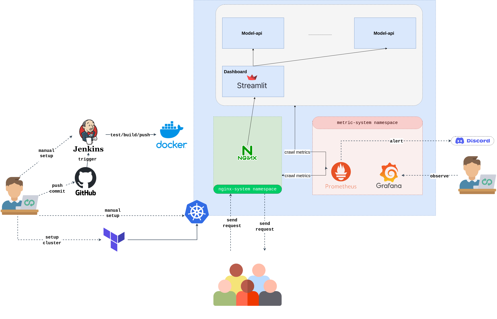

# Rock Fragment Detection Dashboard

An advanced computer vision application that detects and analyzes rock fragments in images using machine learning.



# Local
### Step 1: Install necessary dependencies
```bash
pip install -r app/dashboard/requirements.txt
pip install -r app/model-api/requirements.txt
```

### Step 2: Run the backend
Terminal 1
```bash
make run_app
```

### Step 3: Run the frontend (on a new terminal)
Terminal 2
```bash
make run_dashboard
```

### Step 4: Access the frontend
Access the front-end of the service: http://0.0.0.0:8501

# Cloud
still updating...
